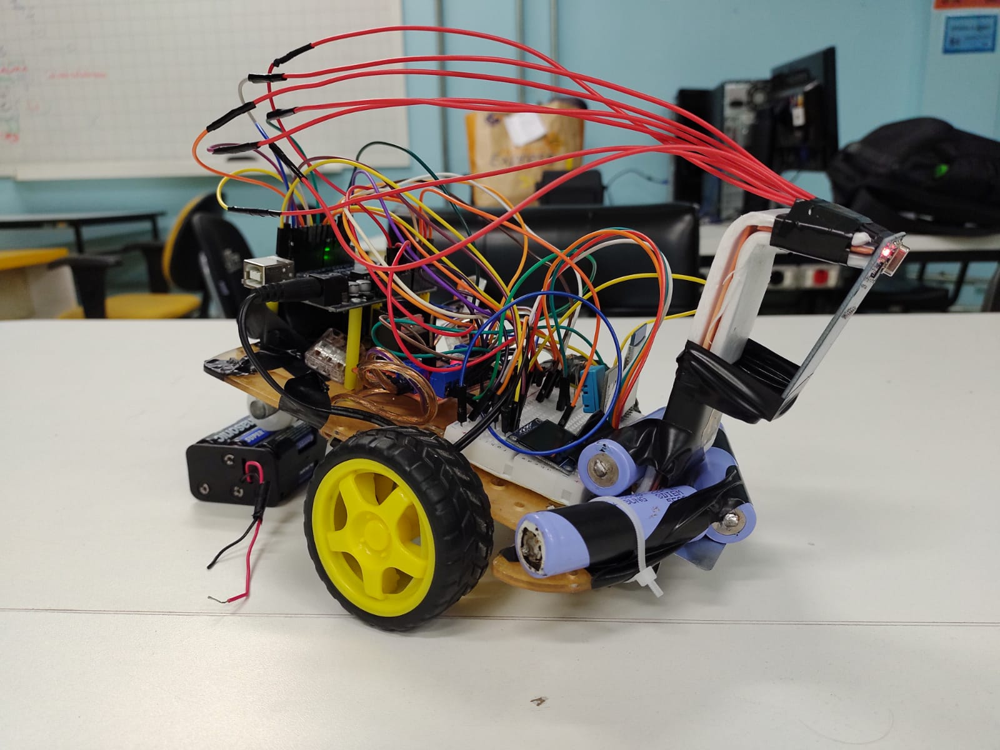
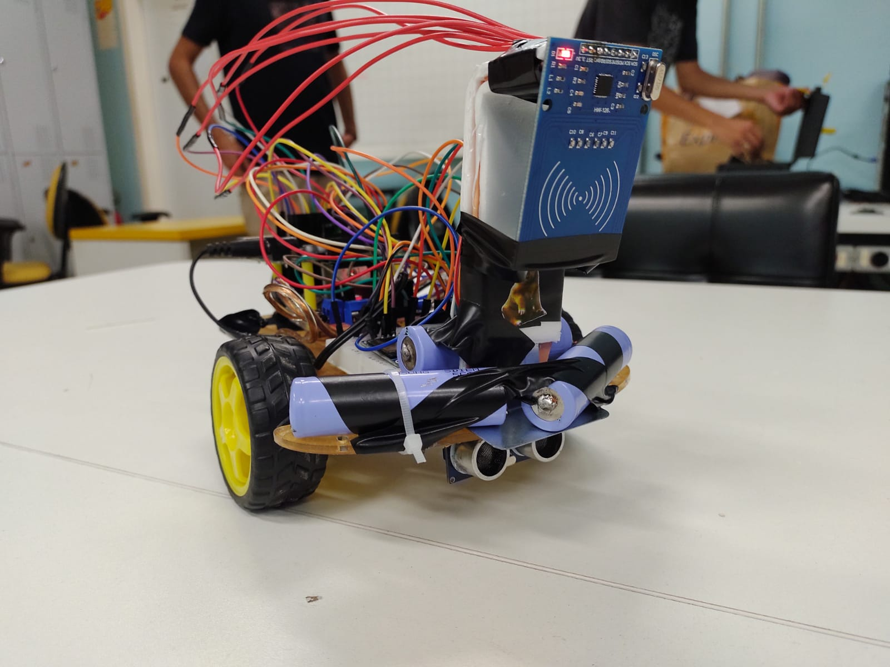
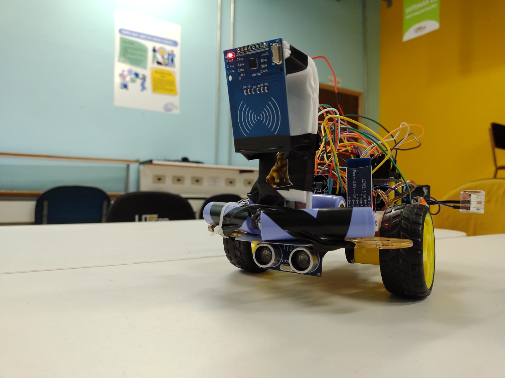

# Projeto de Instrumentação Industrial UTFPR

Esse projeto consiste em um carrinho que é controlado por um aplicativo Android. Também possui um modo autônomo, que após entrar em uma área específica, deve encontrar uma tag RFID e sair de ré. Integrantes da equipe:

- Arthur Lima Costa Mehl
- Bruno Pinheiro Advíncula
- Guilherme Kaiser

 

 

 

 
O carrinho é alimentado por um pack de 3 baterias 18650, totalizando 11,8 V.